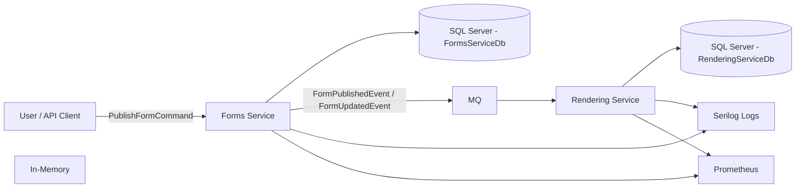

#### 📄 Forms & Rendering Services - Assessment

### Overview
This solution implements a **Forms Service** and a **Rendering Service** that communicate via an event-driven architecture.  
The core feature demonstrated is publishing and updating a form in the **Forms Service**, with the change propagated to the **Rendering Service** via a message bus.

The system also demonstrates **observability** via structured logging (**Serilog**) and monitoring metrics (**Prometheus Counter**).

---

### ✨ Features

a. **Forms Service**

* Publishes forms from Draft to Published state.

* Persists data in SQL Server using EF Core.

* Emits domain events (FormPublishedEvent, FormUpdatedEvent) to EentBus.

* Structured logging via Serilog.

* Publishes metrics to Prometheus.

b. **Rendering Service**

* Listens to EventBus events from Forms Service.

* Updates its own rendering database accordingly.

* Logs operations and exposes metrics.

### 🧪 Tests

a. **Unit Tests**

* Validates legal and illegal state transitions in PublishFormHandler.

* Ensures correct event publishing for valid requests.

* Asserts error responses for missing forms or invalid states.

b. **Integration Test**

* Verifies that a publish/update action in the Forms Service is reflected in the Rendering Service.

* Uses an in-memory RabbitMQ (or test container) to simulate real communication.

* Uses test SQL Server container for database operations.

### 📊 Observability

a. **Serilog**

* Structured logging to console and file.

* Logs key fields: TenantId, FormId, State, Action.

b. **Prometheus**

* Metric: fe_forms_published_total – increments every time a form is published.

* Useful for monitoring publishing activity.

### 📂 Project Structure

SemanixEngine
├───src
│   │
│   ├───FormsService
│   │   │
│   │   ├───FormsService.API
│   │   │   │
│   │   │   ├───Controllers  
│   │   │   │
│   │   │   ├───Middleware
│   │   │   │
│   │   │   │
│   │   ├───FormsService.Application
│   │   │   │
│   │   │   ├───Commands
│   │   │   │
│   │   │   ├───Constants 
│   │   │   │
│   │   │   ├───Extensions
│   │   │   │
│   │   │   ├───Mapping
│   │   │   │
│   │   │   ├───Models
│   │   │   │   │
│   │   │   │   ├───Request
│   │   │   │   │
│   │   │   │   └───Response
│   │   │   │
│   │   │   ├───Queries
│   │   │   │
│   │   │   └───Validators
│   │   │
│   │   │
│   │   ├───FormsService.Domain
│   │   │   │
│   │   │   ├───Entities
│   │   │   │
│   │   │   ├───Enums
│   │   │   │
│   │   │   │
│   │   └───FormsService.Infrastructure
│   │       │
│   │       ├───Handlers
│   │       │
│   │       ├───Metrics
│   │       │
│   │       ├───Migrations
│   │       │
│   │       ├───Persistence
│   │       │
│   │       └───Repository
│   │
│   │
│   ├───RenderingService
│   │   │
│   │   ├───RenderingService.API
│   │   │   │
│   │   │   ├───Controllers
│   │   │   │
│   │   ├───RenderingService.Application
│   │   │   │
│   │   │   ├───Implementations
│   │   │   │
│   │   │   ├───Interfaces
│   │   │   │
│   │   ├───RenderingService.Domain
│   │   │   │
│   │   │   ├───Constants
│   │   │   │
│   │   │   ├───Entities
│   │   │   │
│   │   │   ├───Models
│   │   │   │
│   │   └───RenderingService.Infrastructure
│   │       │
│   │       ├───Migrations
│   │       │
│   │       ├───Persistence
│   │       │
│   │       └───Repository
│   │           │
│   │           ├───Command
│   │           │
│   │           └───Query
│   │
│   └───Shared
│       │
│       └───Shared.Common
│           │
│           ├───Contracts
│           │
│           ├───Events
│           │
│           ├───Messaging
│           
└───tests
     │
     │──SemanixEngine.Tests
     │   │
	 │───FormsService
            │
            ├───IntegrationTests
            │
            └───UnitTests 

### 🏗 Architecture

